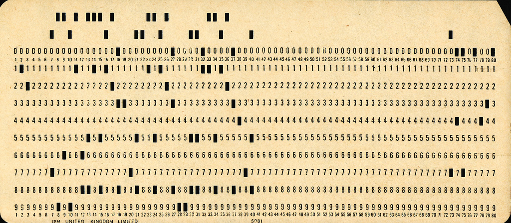
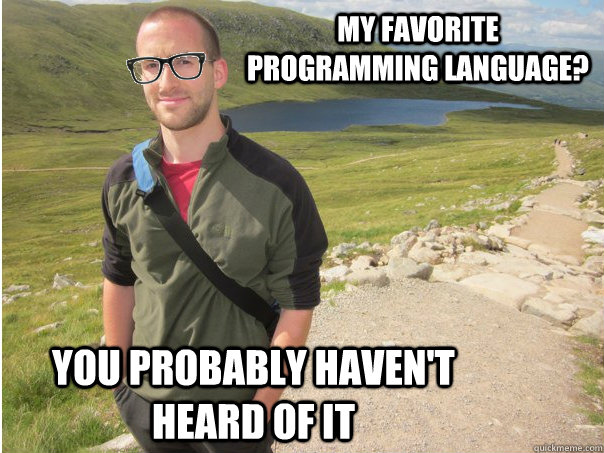
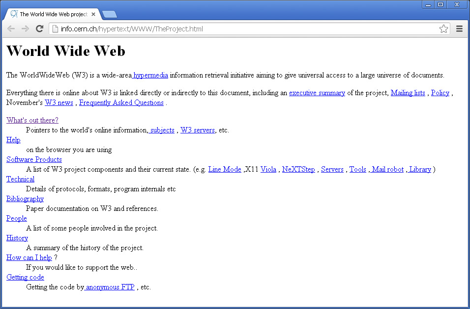
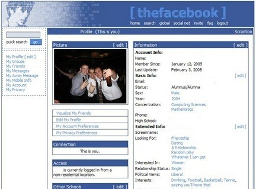

#Intro to Programming

##Objectives

*   Write pseudo code to solve a basic problem.
*   Define web site behavior and the practical uses of JavaScript.
*   Predict DOM output / changes by reading JS code.


---

##Agenda

*   Introduction To Programming
*   What is JS and What Can it Do
*   Lab

---


#Introduction To Programming

The computer will do what you tell it to do.

---


##What is a Program

A __program__ is a set of instructions that you write to tell a computer what to do

---

##What Is Programming

__Programming__ is the task of writing those instructions in a language that the computer can understand.


---

##Becoming A Programmer

It isn't about the programming language - it's a way of thinking.

---

##How Computers 'Think'

They don't.

Buuut, they pretend to by sequentially executing simple instructions.

The only things a computer knows are the things we tell it.

-- 

###CPU (Central Processing Unit)


--

###Machine Code

```
011011111000100000100000001010010111101101100000010000001101000000010 
110000001001100110001101010001111011100101111000011100010110000110111 
101101011011100110010000100010001100001100000011110111011110011011011
```

--

###Assembly Code

```
 global  _start

        section .text
_start:
        ; write(1, message, 13)
        mov     rax, 1                  
        mov     rdi, 1                  
        mov     rsi, message            
        mov     rdx, 13                 
        syscall                         
        write

        ; exit(0)
        mov     eax, 60                 
        xor     rdi, rdi                
        syscall                         
message:
        db      "Hello, World", 10
```

--

##Low-level Programming Language

```
#include <stdio.h>
 
int main()
{
  char string[] = "Hello World";
 
  printf("%s\n", string);
 
  return 0;
}
```

--

##High-level Programming Language

```
alert('Hello, World!')
```

---

##Language EXPLOSION

--

###Modern, popular languages

- Javascript
- Python
- Swift
- Ruby


--

###Foundational languages

- Java
- C
- C++
- C#
- PHP 


--

###Languages that, believe it or not, are still used

- Perl
- Fortran
- COBOL
- Visual Basic
- Pascal



--

###Cutting edge languages
- Go
- Dart
- Haskell
- Erlang
- Elm
- Elixer
- Scala



--

###Special purpose languages

- R
- ArnoldC


--

###A Valid ArnoldC Program

```
IT'S SHOWTIME
TALK TO THE HAND "hello world"
YOU HAVE BEEN TERMINATED
```


---


##Pseudo Code

Pseudocode is the process of writing a program without using the syntax of a programming language.

Note:
We will talk about algorithms later.

Pseudocode is a mixture of natural language and high-level programming constructs. For example,
If the door is closed and I want to exit the room, then open the door
This semester we will learn what these keywords and structures are and how they are used to create a program…

---


##Thermostat

---


##Rock Paper Scissors

---

##What Is JavaScript?

- Insanely popular
- High level syntax, low barrier to entry
- Runs (almost) anywhere
- The only language that runs in the browser (today)

Note:

- Hasn't always been only browser language, nor will it always be (probably)
- Runs on the server, in robots, databases, etc

--

###In the Beginning, There was HTML



<small>Credit: A Look Back at 20+ Years of Website Design - Myia Kelly</small>

Note:

- Internet predates web pages (developed by military and universities for information sharing)
- WWW and HTML invented at CERN in the late 80s, early 90s in large part by Tim Berners-Lee
- No styles, no interactivity - just text and links

--

###Make it Pretty(ish)


<small>Credit: A Look Back at 20+ Years of Website Design - Myia Kelly</small>

--

###Make it Interactive!



Note:

- JavaScript was developed in 10 days by one developer (Brendan Eich) for Netscape. It needed to be done quickly so that it could gain adoption over Microsoft's browser language.
- No relation to Java, naming it JavaScript was a marketing play
- Has evolved enormously since 1995 when it was created

---

##What Can JavaScript Do?

Respond to user interaction

- https://generalassemb.ly/education/digital-marketing
- https://www.whitehouse.gov/economy/jobs
- https://isl.co/
- https://www.addthis.com/dashboard

---


##Color Switcher

---


##Traffic Light

http://codepen.io/nevan/pen/shtLA

---

##Goodnight!

Class 9 Exit Ticket: http://goo.gl/forms/0pEh2Vyx2Y

---
